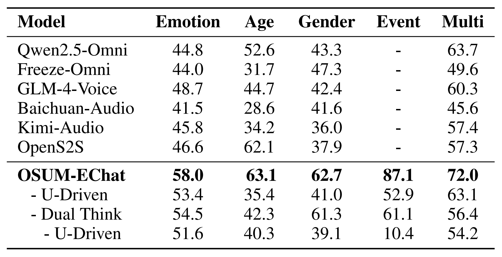

 <p align="left">
        <a href="README_CN.md">中文</a> &nbsp｜ &nbsp English&nbsp&nbsp
</p>

## Training Strategy
To enable OSUM-EChat to achieve empathetic dialogue in resource-constrained environments, the study proposes a three-stage training strategy called **"Understanding-Driven Spoken Dialogue"**, which consists of the stages of understanding, generation, and empathy. In the empathy stage, a **dual-thinking mechanism of linguistic and paralinguistic information** is introduced to explicitly separate paralinguistic and semantic information, thereby helping the model generate more empathetic responses.

### Stage 1: Understanding
The goal of this stage is to enable the LLM to understand both linguistic and paralinguistic information in speech. OSUM’s **“ASR+P” strategy** is employed (where *P* represents paralinguistic labels such as emotion, gender, age, and sound events). Multiple “ASR+P” tasks are jointly trained, with only the encoder and adapters being trainable.

### Stage 2: Generation
This stage aims to equip the OSUM-based understanding model with speech generation capabilities. A two-step training process is adopted: text-to-speech (TTS) generation and speech-to-speech (S2S) dialogue. Additionally, text-to-text (T2T) data is incorporated to maintain the model’s reasoning intelligence.

### Stage 3: Empathy
In this stage, linguistic and paralinguistic information obtained from speech understanding is integrated into the dialogue generation process, significantly improving the model’s ability to produce contextually coherent and empathetic responses. By introducing a **dual-thinking mechanism** before generating text and speech responses, the model first recognizes the linguistic content of the user’s speech, then infers paralinguistic details, and finally integrates these insights to generate appropriate responses.

In the design of the **Chain of Thought (CoT)**, the study explores two different textual forms: **label-based CoT** and **natural language-based CoT**, to investigate how different approaches affect the model’s empathetic understanding and response generation.

#### Label-Based CoT
This form follows a fixed template structure. Specifically, the model first outputs the transcription text obtained via automatic speech recognition (ASR), extracting semantic information from the user’s input. Then, it sequentially outputs predefined paralinguistic labels such as age, gender, speech events, and emotion. The main advantage is that the CoT stage produces content with relatively fixed format and short length, making the process easy to control and efficient in extracting and integrating core paralinguistic cues. However, this approach has limitations: due to the restricted number and scope of predefined labels, it cannot fully express richer and more nuanced paralinguistic states, such as subtle shifts in tone intensity or fine-grained emotional transitions.

#### Natural Language-Based CoT
This form abandons the fixed label template in favor of natural, fluent language descriptions. The model generates coherent textual paragraphs: first interpreting the semantic meaning of the user’s speech (rather than merely transcribing it), then describing the paralinguistic details in depth — including specific manifestations of age characteristics, gender-related vocal traits, the contexts and features of various speech events, and fine-grained emotional layers and dynamics. The advantage of this method is its flexibility in overcoming label limitations, allowing the model to capture and express complex paralinguistic states more comprehensively, thereby providing richer grounding for empathetic response generation. However, its content is harder to control in length and structure, which may increase computational overhead and require stronger language organization abilities from the model.


## Evaluation
Automatic evaluation results on EChat-eval benchmark. Here, ‘U-Driven’ refers to the understanding-driven
spoken dialogue training strategy, and ‘Dual Think’ refers to the linguistic-paralinguistic dual think mechanism.
<p align="center">
    
<p>


Human evaluation results of representative models
on the EChat-eval benchmark. † ByteDance’s commercial system with response from a single fixed speaker.
<p align="center">
    
<p>


Performance on VoiceBench Benchmarks.
<p align="center">
    
<p>

Performance of speech understanding tasks across multiple public datasets, encompassing various distinct speech comprehension tasks.
<p align="center">
    
<p>


````markdown
## How to Use the OSUM-EChat Code Framework for Training and Inference

### Preparing the Environment

Before starting, make sure your Python environment is ready. Below is a suggested workflow. We assume you already have **conda** installed on your computer.  
If not, please refer to: [Linux One-Click Install Miniconda](https://blog.csdn.net/qq_41636123/article/details/130266232).  
We highly recommend running our code on a Linux system.

```shell
# Create a new conda environment
conda create -n OSUM-EChat python=3.10
# Activate the newly created environment
conda activate OSUM-EChat
# Download our code and install required python packages
git clone https://github.com/ASLP-lab/OSUM.git
cd OSUM/OSUM-EChat
# If training on GPU, remove the torch_npu entry from requirements.txt. 
# If training on NPU, no changes are needed.
pip install -r requirements.txt -i https://pypi.tuna.tsinghua.edu.cn/simple
````

### Understanding Data Types

This project supports three types of data: **raw**, **shard**, and **combine**.
The **combine** type is newly designed based on Wenet’s existing raw and shard formats.

#### **Raw Type**:

Data is stored in **jsonl** format, one JSON object per line, with the following fields:

```
{
"key": "1023390_bed51684_10", 
"txt": "Hello sister, you want to join the expert service system, which shows you care a lot about this issue. Having professionals to answer your questions will definitely give you peace of mind. Don’t worry, such systems usually have detailed processes, take it step by step and you’ll join smoothly～", 
"wav": "./common_utils/fake_data/raw/wav/random.wav", 
"extra": {"age": "<ADULT>", "gender": "<FEMALE>", "think_str": "...", "question": "...", "speech_token": [...], "a_wav_path": "..."},
"task": "<S2TCHAT> <TEXT2TOKEN> <THINK>"
}
```

Example:

```
./common_utils/fake_data/raw/data.list
```

#### **Shard Type**:

Data is packed into **tar files**, storing multiple entries together for efficient bulk loading.

Example:

```
./common_utils/fake_data/shard/shards_list.txt
```

Conversion script (from raw type):

```shell
python ./common_utils/fake_data/shard/do_make_shard_from_raw.py 
```

#### **Combine Type**:

The shard format is efficient for reading but hard to modify. To address this, we designed the **combine type**, which stores audio in **tar packages** while metadata is stored in JSON files.

Example:

```
./common_utils/fake_data/combine/combines_list.txt   # Stores mapping between tar and jsonl
./common_utils/fake_data/combine/combines_tar_root.txt # Stores tar directory
```

* Tar packages must be in the same directory (tar-dir-path + tar-file-name = full path).
* Shares the same type flag as “shard”.
* Output files must be named **combines\_list.txt** and **combines\_tar\_root.txt**.

Conversion script (from shard type):

```shell
python ./common_utils/fake_data/combine/do_make_combine_from_shard.py 
```

#### Data Testing

The project provides scripts to directly construct dataloaders for all three data types:

```shell
python do_test_dataloader.py
```

---

### Inference

This project provides three types of **offline inference** (already open-sourced) and one **real-time online inference** (coming soon).

#### Step 1. Download Model Checkpoints

```python
from huggingface_hub import hf_hub_download

# For natural language think model
pt_file_path = hf_hub_download(repo_id="ASLP-lab/OSUM-EChat", filename="language_think_final.pt")  

# For tag-based think model
pt_file_path2 = hf_hub_download(repo_id="ASLP-lab/OSUM-EChat", filename="tag_think_final.pt")  

# Token2wav model (compressed tar file)
pt_file_path3 = hf_hub_download(repo_id="ASLP-lab/OSUM-EChat", filename="CosyVoice-300M-25Hz.tar")  

# Extract token2wav model parameters
import os
os.system(f"tar -xvf {pt_file_path3}")  
```

#### Gradio-Based Offline Inference

Before running, set checkpoint paths in `./infer_gradio.py`:

```python
CHECKPOINT_PATH_A="**/language_think_final.pt"
CHECKPOINT_PATH_B="**/tag_think_final.pt"
cosyvoice_model_path = "**/CosyVoice-300M-25Hz"
```

* Loads **language\_think**, **tag\_think**, and **token2wav** (requires \~19G memory).
* If `CHECKPOINT_PATH_B=None`, only **language\_think** is loaded.

Run:

```shell
python infer_gradio.py
```

#### Single Utterance Inference

Supports almost all task types: speech understanding, TTS, S2S dialogue, S2T dialogue, T2T dialogue, etc.

```shell
python infer_runtime.py
```

#### Batch Inference

Provides batch inference using dataloaders, supporting all three data types.

```shell
bash infer_with_shards_or_raw.sh
```

#### Flask-Based Online Inference

Coming soon.

---

### Training

Coming soon.
