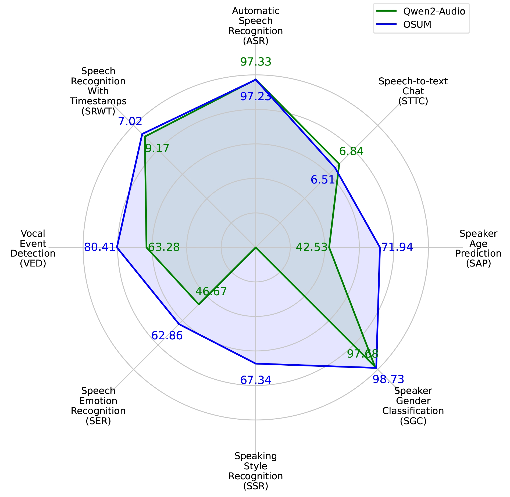
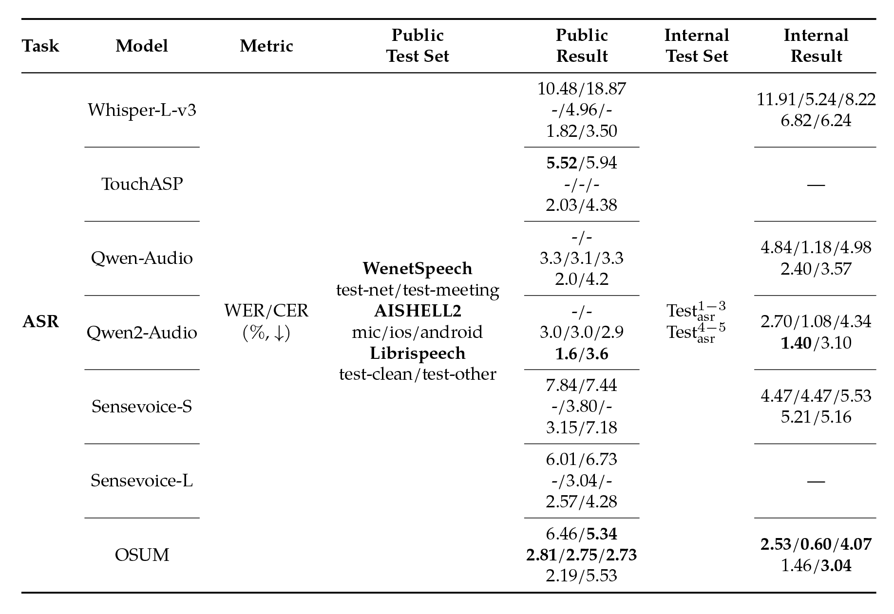
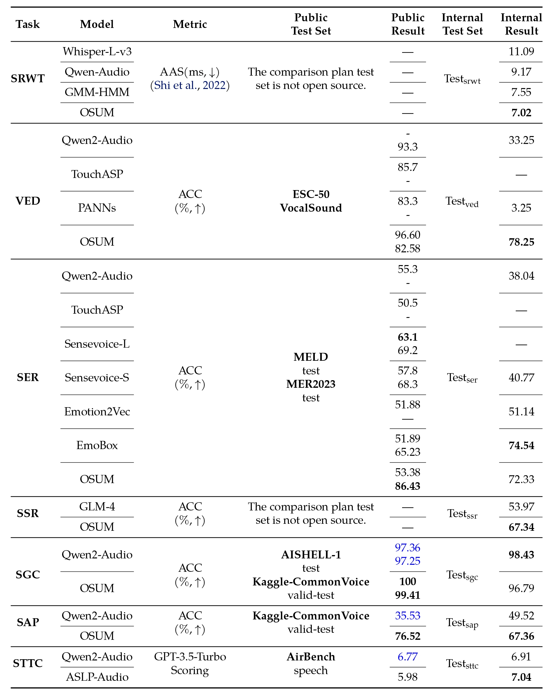

<p align="center">
   <h1>OSUM: Advancing Open Speech Understanding Models with Limited Resources in Academia</h1>
<p>

耿雪龙, 魏坤, 邵琪杰, 刘水云*, 林振楠*, 赵致闲*, 李国健*, 田文杰*, 陈培坤, 李泱泽, 郭鹏程, 邵明辰, 王水源, 曹雨昂, 王成有, 徐天翼, 戴宇航, 朱新发, 李越, 张丽, 谢磊†


<p align="center">
    
<p>

<p align="center">
 <a href="https://huggingface.co/spaces/ASLP-lab/OSUM"> Huggingface Test Page</a> |   <a href="https://huggingface.co/ASLP-lab/OSUM"> Ckpt</a>
<br>
📑 <a href="https://arxiv.org/abs/2501.13306v2">Paper (v2.0)</a> &nbsp&nbsp | &nbsp&nbsp 📑 <a href="https://aslp-lab.github.io/OSUM.github.io/">Demo</a> &nbsp&nbsp | &nbsp&nbsp 💬 <a href="images/introduction.md">WeChat (微信)</a>&nbsp&nbsp 
</p>

<h3 align="center">OSUM读作 ‘awesome’ (/ˈɔː.səm/)</h3>

大型语言模型（LLMs）在各种下游任务中取得了显著进展，启发了业界对语音理解语言模型（speech understanding language models, SULMs）的开发，以期实现基于语音情感、性别等副语言的高表现力交互。然而，大多数先进的SULMs是由行业头部公司开发的，这消耗了大规模的数据和计算资源，而这些在学术界并不容易获得。此外，虽然训练好的模型和推理代码被开源了，但训练框架和数据处理流程依然缺乏透明度，这也为进一步研究产生了障碍。在本研究中，我们提出了OSUM，一个开放的语音理解模型，旨在探索在有限的学术资源下训练SLUMs的潜力。OSUM模型将Whisper编码器与Qwen2 LLM相结合，支持广泛的语音任务，包括语音识别（ASR）、带时间戳的语音识别（SRWT）、语音事件检测（VED）、语音情感识别（SER）、说话风格识别（SSR）、说话者性别分类（SGC）、说话者年龄预测（SAP）和语音转文本聊天（STTC）。通过采用ASR+X训练策略，OSUM通过同时优化模态对齐和目标任务，实现了高效稳定的多任务训练。除了提供强大的性能，OSUM还强调透明度，我们提供公开可用的代码，并详细介绍了数据处理流程，以期为学术界提供有价值的参考。通过这样做，我们旨在加速先进SULM技术的研究和创新。

## Architecture

OSUM模型将Whisper编码器与Qwen2 LLM相结合，支持广泛的语音任务，包括语音识别（ASR）、带时间戳的语音识别（SRWT）、语音事件检测（VED）、语音情感识别（SER）、说话风格识别（SSR）、说话者性别分类（SGC）、说话者年龄预测（SAP）和语音转文本聊天（STTC）。通过采用ASR+X训练策略，OSUM通过同时优化模态对齐和目标任务，实现了高效稳定的多任务训练。

<p align="center">
    
<p>

# 评估
Qwen2-Audio 与我们的 OSUM 模型对比。在大多数任务中，尽管 OSUM 所用的计算资源和训练数据显著更少，但其性能仍优于 Qwen2-Audio。
<p align="center">
    
<p>

在公开测试集和内部测试集上的自动语音识别（ASR）任务评估结果。粗体字代表同一测试集中的最佳结果。所有内部测试结果均由我们自行推导得出。
<p align="center">
    
<p>

在公开测试集和内部测试集上的多任务评估结果。每个测试集中的最佳结果以粗体字突出显示。蓝色字体显示的结果以及内部测试集上的所有结果，均由我们使用原始发布的模型自行推导得出。
<p align="center">
    
<p>


# 如何使用OSUM模型框架来训练和推理

## 准备环境

在开始之前请保证你的python环境已经准备好, 如下是一个建议的操作流程。我们假设你的电脑上已经安装了conda软件。如果未安装，请参考：[linux一键安装Miniconda](https://blog.csdn.net/qq_41636123/article/details/130266232) 。 我们非常建议你在linux系统的电脑上运行我们的代码。

```shell
# 新创建一个conda环境
conda create -n OSUM python=3.10
# 激活新创建的环境
conda activate OSUM
# 下载我们的代码并安装需要的python包
git clone https://github.com/ASLP-lab/OSUM.git
cd OSUM
# 如果你在gpu训练，请先删除 requirements.txt 中torch_npu的条目，如果是npu上，则无需操作。
pip install -r requirements.txt -i https://pypi.tuna.tsinghua.edu.cn/simple
```

## 推理

首先我们看一下如何推理。

使用过到的的文件主要有：OSUM/examples/osum/infer.sh

### 首先下载ckpt： 

ckpt ,从我们的huggingface库中下载模型checkpoint，可以通过python的方式下载：

```python
# 从Hugging Face下载.pt文件
from huggingface_hub import hf_hub_download
pt_file_path = hf_hub_download(repo_id="ASLP-lab/OSUM", filename="infer.pt") # 此时pt_file_path直接就是下载后的ckpt的具体路径
```

或者通过huggingface网站下载：https://huggingface.co/ASLP-lab/OSUM

然后在infer.sh中设置ckpt变量：

```shell
ckpt_path=***/infer.sh # 请将***替换为下载后的ckpt的具体路径
```

### 接着准备数据

我们支持对两种数据的推理（遵循[wenet](https://github.com/wenet-e2e/wenet)开源框架的规范）

- raw格式： 需要传入一个jsonl格式的文件，其中每一行一个json字典的格式，其中字典key值包括包括“key”:音频唯一性标示， “wav”: 音频的具体路径（不局限于wav格式），"txt"音频对应的文本，实际推理场景可以为任何值，但请尽可能保证该key值的存在，以避免代码层面可能的错误。

  具体举例：

  ```json
  {"key": "BAC009S0764W0122", "wav": "***/wav/BAC009S0764W0122.wav", "txt": "一二线城市虽然也处于调整中"}
  ```

- shard_full_data 格式： 更多使用场景为训练，来加速机器读取文件的速度，也可以用于训练。其把若干条音频（比如说1000条)保存到一个tar包种，“key”的内容作为文件名的形式存在。以上述音频条目距离，在其所在的tar包种，其应转化为如下两个文件：BAC009S0764W0122.txt和BAC009S0764W0122.wav两个文件，其中文件后缀为其对应的变量值，文件名为音频的唯一标识。

当你准备好了数据清单文件，则在infer.sh中设置数据文件变量：

```shell
data_path=***/data.jsonl
```


### 选择合适的任务

OSUM当前开源版本支持多个任务，你可以根据OSUM/examples/osum/conf/prompt_config.yaml 文件中的任务tag来选择你希望推理的任务，并在 OSUM/examples/osum/infer.sh中填入你希望推理任务的tag。 同时需要注意的是prompt_config.yaml里面的tag含有空格，而在infer.sh中写入的tag需要手动将空格删除（受到shell语法的限制）。

具体举例：

```shell
 task="<TRANSCRIBE><GENDER>"    # 该tag用于asr+性别任务
```

### 选择合适的gpu/npu

OSUM模型在华为升腾910B上进行训练的，但训练和推理代码均同时支持gpu和npu。如果在gpu上训练，请在启动脚本中设置将train_backend设置为nccl，而非hccl。

我们本项目的推理大致需要20G的显存。如果你机器上有这样的显卡，设置你希望在其上推理的显卡序号：

```shell
gpu_id=3
```

### 开始推理！

如下是一个完整的infer.sh的示例：
```shell

export CUDA_VISIBLE_DEVICES=0,1,2,3,4,5,6,7
lang=zh 
prompt_file=conf/prompt_stage4.yaml
ckpt_path=**/infer.sh # 请将***替换为下载后的ckpt的具体路径
data_path=**/data.list
data_type="raw"
gpu_id=3  
output_dir=./**
task="<TRANSCRIBE><GENDER>"
bash decode/do_docode.sh --output_dir $output_dir --task $task --data_type $data_type --data_path $data_path --gpu_id $gpu_id --ckpt_path $ckpt_path --lang $lang --prompt_file $prompt_file
```

### 如何更加直接的推理?
- 对于单条音频的推理
```shell
# 把该文件中的 checkpoint_path 变量设置为本地一下载的ckpt, 然后再main函数中设置对应的音频路径和prompt
python  OSUM/examples/osum/runtime/infer_runtime.py
```

- 部署并进行网页端推理
```shell
# 部署并启动服务，会再本地127.0.0.1:7860部署一个测试网页，同样需要先设置 checkpoint_path变量
python  OSUM/examples/osum/runtime/infer_gradio.py
```

## 训练

接着我们看一下如何进行训练。

主要涉及的文件有： OSUM/examples/osum/run_huawei_2p_master.sh & OSUM/examples/osum/run_huawei_2p_rank1.sh & OSUM/examples/osum/run_huawei_2p_rank2.sh

本项目默认支持多机训练，现行的代码如果不做更改，则默认进行3机8卡训练。

### ckpt下载

同推理章节的介绍

### 数据准备

强烈建议使用shard_full_data格式的方式， 来最大化减缓加载数据带来的时间消耗，单个tar文件包含的音频个数建议为1000。 

数据准备好后，需要把数据清单写道OSUM/examples/osum/conf/data_config_huawei.yaml文件中，具体的data_config_huawei.yaml内容举例：

```yaml
data_name1:
	path: "***/shards_list.txt"
	weight: 3  # 权重， 对该数据清单文件的数据量翻3倍
data_name2:
	path: "***/shards_list.txt"
	weight: 1  
```

对于shards_list.txt的具体举例：

```txt
***/***/0001.tar
***/***/0002.tar
***/***/0003.tar
***/***/0004.tar
......
```


### 多机多卡训练

多个机器需要有多个启动文件，并且需要设置一个机器为协调者机器。对于现行代码，我们在协调者机器上执行文件：  OSUM/examples/osum/run_huawei_2p_master.sh ，在其他机器上分别执行： OSUM/examples/osum/run_huawei_2p_rank1.sh &和 OSUM/examples/osum/run_huawei_2p_rank2.sh

我们应保证这三个文件几乎完全想通过的内容，除了这里的node_rank需要不同：

```shell
  torchrun --nnodes=$num_nodes --nproc_per_node=$num_gpus --node_rank=0 \ 
          --master_addr=$HOST_NODE_ADDR --master_port=$HOST_PORT \
```

run_huawei_2p_master.sh 里面需要设置0 node_rank，其他机器以此是1, 2 ,3 ,4  ...

对于其他的配置，有：

- 机器数量

  ```
  num_nodes=3
  ```

- 协调者机器的ip

  ```
  HOST_NODE_ADDR=192.168.0.15
  ```

- 其他变量

  ```
  checkpoint=*** # 为空则为随机初始化
  data=***  # 数据存放的目录
  dir=***   # 新ckpt的存放位置
  ```

### 单机训练

只需要把 OSUM/examples/osum/run_huawei_2p_master.sh 中的机器数量设为1，协调者ip设置为本机ip即可。 

单机训练时，如果相对训练机器的个数进行修改，只需要灵活修正：

```shell
export CUDA_VISIBLE_DEVICES="0,1,2,3,4,5,6,7"
```

### 训练超参数

具体的参数在如下文件中设置：

OSUM/examples/osum/conf/config_llm_huawei_base-version.yaml

