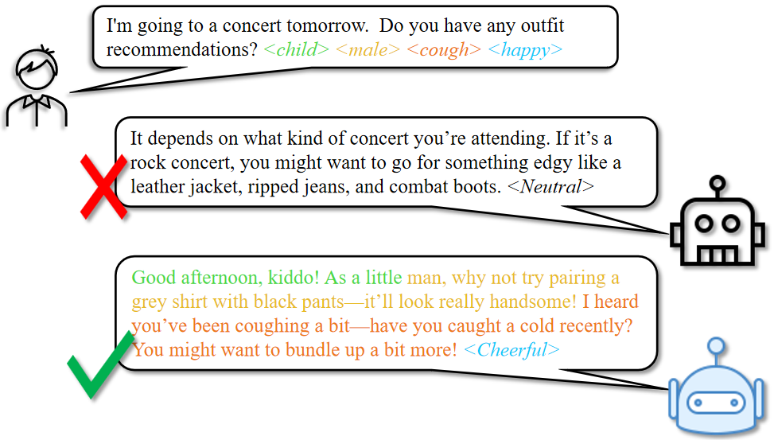

<p align="left">
        <a href="README_CN.md">中文</a> &nbsp｜ &nbsp English&nbsp&nbsp ｜ <a href="README_JP.md">日本語</a> &nbsp
</p>


<p align="center">
   <h1>OSUM-EChat: Enhancing End-to-End Empathetic Spoken Chatbot via Understanding-Driven Spoken Dialogue</h1>
<p>

Xuelong Geng, Qijie Shao, Hongfei Xue, Shuiyuan Wang, Hanke Xie, Zhao Guo, Yi Zhao, Guojian Li, Wenjie Tian, Chengyou Wang, Zhixian Zhao, Kangxiang Xia, Ziyu Zhang, Zhennan Lin, Tianlun Zuo, Mingchen Shao, Yuang Cao, Guobin Ma, Longhao Li, Yuhang Dai, Dehui Gao, Dake Guo, Lei Xie


<p align="center">
    
<p>

<p align="center">
 <a href="https://www.osum-echat.npu-aslp.org/"> Test Page</a> </a>&nbsp
<br>
📑 <a href="https://www.arxiv.org/abs/2508.09600">Paper</a> &nbsp&nbsp | &nbsp&nbsp 📑 <a href="https://aslp-lab.github.io/osum-echat.github.io/">Demo</a> &nbsp&nbsp | &nbsp&nbsp 💬 <a href="raw/fig/wechat.png">WeChat (微信)</a>&nbsp&nbsp 
</p>

Empathy is crucial in enabling natural interactions within spoken dialogue systems, allowing machines to recognize and respond appropriately to paralinguistic cues such as age, gender, and emotion. 
Recent advancements in end-to-end speech language models, which unify speech understanding and generation, provide promising solutions. 
However, several challenges persist, including an over-reliance on large-scale dialogue datasets, insufficient extraction of paralinguistic cues vital for conveying empathy, and the lack of empathy-specific datasets and evaluation frameworks. 
To address these issues, we introduce OSUM-EChat, an open-source, end-to-end spoken dialogue system designed to enhance empathetic interactions, particularly in resource-limited settings. 
Based on [OSUM](https://github.com/ASLP-lab/OSUM/tree/main/OSUM), OSUM-EChat introduces two key innovations: (1) a three-stage understanding-driven spoken dialogue training strategy that extends the capabilities of a large speech understanding model to spoken dialogue tasks, and (2) a linguistic-paralinguistic dual thinking mechanism that integrates paralinguistic understanding through a chain of thought with dialogue generation, enabling the system to produce more empathetic responses. This approach reduces reliance on large-scale dialogue datasets while maintaining high-quality empathetic interactions. Additionally, we introduce the EChat-200K dataset, a rich corpus of empathetic speech-to-speech dialogues, and the EChat-eval benchmark, a comprehensive framework for evaluating the empathetic capabilities of dialogue systems. Experimental results demonstrate that OSUM-EChat outperforms end-to-end spoken dialogue models regarding empathetic responsiveness, validating its effectiveness.


<p align="center">
    
<p>


## Architecture

This section presents an overview of the overall architecture and core tasks of OSUM-EChat. OSUM-EChat consists of three modules: a speech encoder (with an adapter), a text LLM (Large Language Model), and a token-to-speech module. It also possesses a wide range of speech functions, including various speech understanding tasks (speech-to-text), speech synthesis tasks, speech dialogue tasks, and text dialogue tasks. Meanwhile, by leveraging internally constructed empathetic dialogue data and a paralinguistic information reasoning mechanism, OSUM-EChat can generate more empathetic responses in speech dialogue tasks.
<p align="center">
    
<p>

## More Details of OSUM-EChat and Guidelines for Training and Inference
<p align="left">
For more introductory information about OSUM-EChat and instructions on how to use the OSUM-EChat framework for inference and training, please refer to <a href="OSUM-EChat/README.md">HERE</a>.
</p>


<br>
<br>
<br>
<br>


<p align="center">
   <h1>OSUM: Advancing Open Speech Understanding Models with Limited Resources in Academia</h1>
<p>

Xuelong Geng, Kun Wei, Qijie Shao, Shuiyun Liu*, Zhennan Lin*, Zhixian Zhao*, Guojian Li*, Wenjie Tian*, Peikun Chen, Yangze Li, Pengcheng Guo, Mingchen Shao, Shuiyuan Wang, Yuang Cao, Chengyou Wang, Tianyi Xu, Yuhang Dai, Xinfa Zhu, Yue Li, Li Zhang, Lei Xie†


<p align="center">
    
<p>


<p align="center">
 <a href="https://huggingface.co/spaces/ASLP-lab/OSUM"> Huggingface Test Page</a> </a>&nbsp
<br>
📑 <a href="https://arxiv.org/abs/2501.13306v2">Paper (v2.0)</a> &nbsp&nbsp | &nbsp&nbsp 📑 <a href="https://aslp-lab.github.io/OSUM.github.io/">Demo</a> &nbsp&nbsp | &nbsp&nbsp 💬 <a href="images/introduction.md">WeChat (微信)</a>&nbsp&nbsp 
</p>

 <h3 align="center">OSUM is pronounced as ‘awesome’ (/ˈɔː.səm/).</h3>


Large Language Models (LLMs) have made significant progress in various downstream tasks, inspiring the development of Speech Understanding Language Models (SULMs) to enable comprehensive speech-based interactions. However, most advanced SULMs are developed by the industry, leveraging large-scale datasets and computational resources that are not readily available to the academic community. Moreover, the lack of transparency in training details creates additional barriers to further innovation. In this study, we present OSUM, an Open Speech Understanding Model designed to explore the potential of training SLUMs under constrained academic resources. The OSUM model combines a Whisper encoder with a Qwen2 LLM and supports a wide range of speech tasks, including speech recognition (ASR), speech recognition with timestamps (SRWT), vocal event detection (VED), speech emotion recognition (SER), speaking style recognition (SSR), speaker gender classification (SGC), speaker age prediction (SAP), and speech-to-text chat (STTC). By employing an ASR+X training strategy, OSUM achieves efficient and stable multi-task training by simultaneously optimizing ASR alongside target tasks.
Beyond delivering strong performance, OSUM emphasizes transparency by providing openly available data preparation and training methodologies, offering valuable insights and practical guidance for the academic community. By doing so, we aim to accelerate research and innovation in advanced SULM technologies.


## Architecture

The OSUM model combines the Whisper encoder with the Qwen2 LLM, supporting a wide range of speech tasks, including Automatic Speech Recognition (ASR), Speech Recognition with Timestamps (SRWT), Voice Event Detection (VED), Speech Emotion Recognition (SER), Speech Style Recognition (SSR), Speaker Gender Classification (SGC), Speaker Age Prediction (SAP), and Speech-to-Text Chat (STTC). By adopting the ASR+X training strategy, OSUM achieves efficient and stable multi-task training through simultaneous optimization of modal alignment and target tasks.

<p align="center">
    
<p>

## More Details of OSUM and Guidelines for Training and Inference
<p align="left">
For more introductory information about OSUM and instructions on how to use the OSUM framework for inference and training, please refer to <a href="OSUM/README.md">HERE</a>.
</p>

# News and Updates
### 2025.8.14 🎉 We are extremely honored to introduce OSUM-EChat, a new end-to-end empathetic speech dialogue model. Its related paper has been published ([OSUM-EChat Paper](http://arxiv.org/abs/2508.09600)), and the code and model checkpoints will be made available very soon.

Built on the OSUM large-scale speech understanding model, this model adopts a three-stage training process of "understanding-generation-empathy" and innovatively incorporates empathy-related reasoning mechanisms. It has successfully achieved industry-leading empathetic dialogue capabilities under the condition of limited speech dialogue data. To the best of our knowledge, this is the first empathetic dialogue model in the industry built upon a large-scale speech understanding model, and also a pioneering research achievement in the field of empathetic reasoning.

We have conducted two explorations in the field of empathetic reasoning: label-based reasoning and natural language-based reasoning. Although both reasoning mechanisms have brought about performance improvements, we found that the natural language-based reasoning mechanism can yield more fluent responses and better facilitate the model's capture of subtle paralinguistic cues. The current version of the paper has elaborated on the three-stage training process and the label-based reasoning mechanism, and the content related to the natural language-based reasoning mechanism will be supplemented in the upcoming update.
### 2025.2.16 🎉 We updated the technical report [OSUM technical report v2.0](https://arxiv.org/abs/2501.13306v2) and released the [checkpoint](https://huggingface.co/ASLP-lab/OSUM), and the online [test page](https://huggingface.co/spaces/ASLP-lab/OSUM) on hugging face.
In technical report v2.0, the OSUM model has gone through more training steps and the training data volume has increased to 50.5K hours (as compared to 44.1K hours in v1.0) 
- 3000 hours of speech gender classification (SGC) data, which includes 1500 hours of existing data augmented with noise, and another 1500 hours of new data.
- Speaker age prediction (SAP) data expansion: The original 3400 hours of age prediction data were augmented with noise, doubling the volume to 6800 hours.
### 2025.1.22 🔥 We released the [OSUM technical report v1.0](https://arxiv.org/abs/2501.13306v1).

<br>


# License Agreement

We use the Apache 2.0 license. Researchers and developers are free to use the codes and model weights of our OSUM, even for commercial use. Check the license at [LICENSE.txt](LICENSE.txt) for more details.
<br>

# Citation
```
@article{geng2025osum,
  title={OSUM-EChat: Enhancing End-to-End Empathetic Spoken Chatbot via Understanding-Driven Spoken Dialogue},
  author={Geng, Xuelong and Shao, Qijie and Xue, Hongfei and Wang, Shuiyuan and Xie, Hanke and Guo, Zhao and Zhao, Yi and Li, Guojian and Tian, Wenjie and Wang, Chengyou and others},
  journal={arXiv preprint arXiv:2508.09600},
  year={2025}
}
```

```
@article{geng2025osum,
  title={{OSUM}: {Advancing} Open Speech Understanding Models with Limited Resources in Academia},
  author={Geng, Xuelong and Wei, Kun and Shao, Qijie and Liu, Shuiyun and Lin, Zhennan and Zhao, Zhixian and Li, Guojian and Tian, Wenjie and Chen, Peikun and Li, Yangze and others},
  journal={arXiv preprint arXiv:2501.13306},
  year={2025}
}
```
# Contact Us

If you are interested in leaving a message to our research team, feel free to email `xlgeng@mail.nwpu.edu.cn`.
<p align="center">
    <a href="http://www.nwpu-aslp.org/">
        
    </a>
</p>
<p align="center">
    <a href="https://wenet.org.cn/">
        
    </a>
</p>
