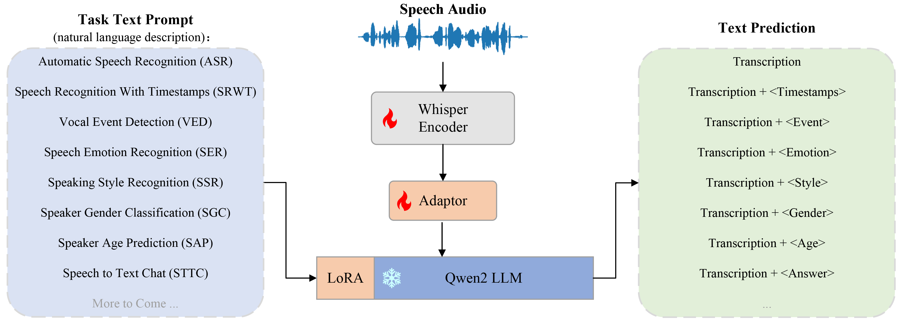

<p align="left">
        &nbsp中文&nbsp&nbsp ｜ <a href="README.md">English</a> &nbsp ｜ <a href="README_JP.md">日本語</a> &nbsp
</p>


<p align="center">
   <h1>OSUM-EChat: Enhancing End-to-End Empathetic Spoken Chatbot via Understanding-Driven Spoken Dialogue</h1>
<p>

耿雪龙、邵琪杰、薛鸿飞、王水源、解晗轲、郭昭、赵懿、李国健、田文杰、王成友、赵致闲、夏康翔、张子萸、林振楠、左天伦、邵明辰、曹雨昂、马国斌、李龙豪、戴宇航、高德辉、郭大可、谢磊

<p align="center">
    
<p>

<p align="center">
 <a href="https://www.osum-echat.npu-aslp.org/"> Test Page</a> </a>&nbsp
<br>
📑 <a href="https://www.arxiv.org/abs/2508.09600">Paper</a> &nbsp&nbsp | &nbsp&nbsp 📑 <a href="https://aslp-lab.github.io/osum-echat.github.io/">Demo</a> &nbsp&nbsp | &nbsp&nbsp 💬 <a href="raw/fig/wechat.png">WeChat (微信)</a>&nbsp&nbsp 
</p>

共情能力对于实现口语对话系统中的自然交互至关重要，它能让机器识别年龄、性别、情绪等副语言线索，并做出恰当回应。近年来，端到端语音语言模型（可统一语音理解与生成功能）的发展为这一领域提供了极具潜力的解决方案。然而，当前技术仍面临诸多挑战：过度依赖大规模对话数据集、对传递共情至关重要的副语言线索提取不足，以及缺乏专门针对共情的数据集与评估框架。为解决这些问题，我们提出了 OSUM-EChat—— 一款开源的端到端口语对话系统，旨在增强共情交互能力，尤其适用于资源受限场景。OSUM-EChat 包含两大核心创新：（1）三阶段理解驱动的口语对话训练策略，该策略将大型语音理解模型的能力扩展到口语对话任务中；（2）语言 - 副语言双思维机制，通过思维链整合副语言理解与对话生成过程，使系统能够生成更具共情性的回应。这种方法在降低对大规模对话数据集依赖的同时，仍能保持高质量的共情交互。此外，我们还构建了 EChat-200K 数据集（一个丰富的共情语音到语音对话语料库）与 EChat-eval 基准（一套用于评估对话系统共情能力的综合框架）。实验结果表明，在共情响应能力方面，OSUM-EChat 优于现有的端到端口语对话模型，验证了其有效性。

## Architecture

本节呈现 OSUM-EChat 的整体架构与核心任务概述。OSUM-EChat由3个模块组成：语音编码器（带适配器）、文本LLM、token转语音模块，并具备广泛的语音功能，包括各类语音理解任务（语音到文本)、语音合成任务、语音对话任务和文本对话任务。同时，借助内部构造的共情对话数据以及副语言信息推理机制，OSUM-EChat在语音对话任务中能够生成更具共情性的回应。

<p align="center">
    
<p>

## 训练与推理指南及OSUM-EChat的更多细节
<p align="left">
如需了解OSUM-EChat的更多介绍信息，以及如何使用OSUM-EChat框架进行推理与训练的操作说明，请参考<a href="OSUM-EChat/README.md">**此处**</a>。
</p>

<p align="center">
   <h1>OSUM: Advancing Open Speech Understanding Models with Limited Resources in Academia</h1>
<p>

耿雪龙, 魏坤, 邵琪杰, 刘水云*, 林振楠*, 赵致闲*, 李国健*, 田文杰*, 陈培坤, 李泱泽, 郭鹏程, 邵明辰, 王水源, 曹雨昂, 王成有, 徐天翼, 戴宇航, 朱新发, 李越, 张丽, 谢磊†


<p align="center">
    
<p>

<p align="center">
 <a href="https://huggingface.co/spaces/ASLP-lab/OSUM"> Huggingface Test Page</a> </a>&nbsp
<br>
📑 <a href="https://arxiv.org/abs/2501.13306v2">Paper (v2.0)</a> &nbsp&nbsp | &nbsp&nbsp 📑 <a href="https://aslp-lab.github.io/OSUM.github.io/">Demo</a> &nbsp&nbsp | &nbsp&nbsp 💬 <a href="images/introduction.md">WeChat (微信)</a>&nbsp&nbsp 
</p>

<h3 align="center">OSUM读作 ‘awesome’ (/ˈɔː.səm/)</h3>

大型语言模型（LLMs）在各种下游任务中取得了显著进展，启发了业界对语音理解语言模型（speech understanding language models, SULMs）的开发，以期实现基于语音情感、性别等副语言的高表现力交互。然而，大多数先进的SULMs是由行业头部公司开发的，这消耗了大规模的数据和计算资源，而这些在学术界并不容易获得。此外，虽然训练好的模型和推理代码被开源了，但训练框架和数据处理流程依然缺乏透明度，这也为进一步研究产生了障碍。在本研究中，我们提出了OSUM，一个开放的语音理解模型，旨在探索在有限的学术资源下训练SLUMs的潜力。OSUM模型将Whisper编码器与Qwen2 LLM相结合，支持广泛的语音任务，包括语音识别（ASR）、带时间戳的语音识别（SRWT）、语音事件检测（VED）、语音情感识别（SER）、说话风格识别（SSR）、说话者性别分类（SGC）、说话者年龄预测（SAP）和语音转文本聊天（STTC）。通过采用ASR+X训练策略，OSUM通过同时优化模态对齐和目标任务，实现了高效稳定的多任务训练。除了提供强大的性能，OSUM还强调透明度，我们提供公开可用的代码，并详细介绍了数据处理流程，以期为学术界提供有价值的参考。通过这样做，我们旨在加速先进SULM技术的研究和创新。

## Architecture

OSUM模型将Whisper编码器与Qwen2 LLM相结合，支持广泛的语音任务，包括语音识别（ASR）、带时间戳的语音识别（SRWT）、语音事件检测（VED）、语音情感识别（SER）、说话风格识别（SSR）、说话者性别分类（SGC）、说话者年龄预测（SAP）和语音转文本聊天（STTC）。通过采用ASR+X训练策略，OSUM通过同时优化模态对齐和目标任务，实现了高效稳定的多任务训练。

<p align="center">
    
<p>

## 训练与推理指南及OSUM的更多细节
<p align="left">
如需了解OSUM的更多介绍信息，以及如何使用OSUM框架进行推理与训练的操作说明，请参考<a href="OSUM/README.md">**此处**</a>。
</p>


## News and Updates

### 2025.8.14 🎉我们非常荣幸地推出全新端到端共情语音对话模型 ——OSUM-EChat，其相关论文已发布（[OSUM-EChat 论文](http://arxiv.org/abs/2508.09600)），代码及模型 checkpoint 将于近期开放。
该模型以 OSUM 语音理解大模型为基础，通过 “理解-生成-共情” 三阶段训练流程，并创新性引入与共情相关的推理机制，在有限语音对话数据条件下，成功实现了业界领先的共情对话能力。据我们所知，这是业界首个依托语音理解大模型构建的共情对话模型，同时也是共情推理领域的开创性研究成果。

我们在共情推理领域进行了两种探索：基于标签的推理和基于自然语言的推理，虽然两种推理机制都带来了性能提升，但我们发现基于自然语言的推理机制能带来更加流畅的回复，也更能促进模型对细微副语言线索的捕捉。当前版本的论文已详细阐述了三阶段训练流程及基于标签的推理机制，后续将在近期更新中补充基于自然语言的推理机制相关内容。


### 2025.2.16 🎉我们更新了技术报告 [OSUM technical report v2.0](https://arxiv.org/abs/2501.13306v2)，并发布了[checkpoint](https://huggingface.co/ASLP-lab/OSUM)，以及 Hugging Face 上的在线 [test page](https://huggingface.co/spaces/ASLP-lab/OSUM)。
在技术报告 v2.0 中，OSUM 模型经过了更多的训练步骤，训练数据量增加到了 50.5K 小时（相比 v1.0 的 44.1K 小时）：
- 3000 小时的语音性别分类（SGC）数据，其中包括 1500 小时的现有数据，通过噪声增强，另有 1500 小时的新数据。
- 说话人年龄预测（SAP）数据扩展：原有的 3400 小时年龄预测数据经过噪声增强，数据量增加到 6800 小时。
### 2025.1.22 🔥 我们发布了 [OSUM technical report v1.0](https://arxiv.org/abs/2501.13306v1)。


<br>


## License Agreement

我们使用的是 Apache 2.0 许可证。研究人员和开发人员可以自由使用我们的 OSUM 的代码和模型权重，甚至可用于商业用途。更多详细信息，请查看许可证文件[LICENSE.txt](LICENSE.txt)中的相关内容。
<br>
## Citation
```
@article{geng2025osum,
  title={OSUM-EChat: Enhancing End-to-End Empathetic Spoken Chatbot via Understanding-Driven Spoken Dialogue},
  author={Geng, Xuelong and Shao, Qijie and Xue, Hongfei and Wang, Shuiyuan and Xie, Hanke and Guo, Zhao and Zhao, Yi and Li, Guojian and Tian, Wenjie and Wang, Chengyou and others},
  journal={arXiv preprint arXiv:2508.09600},
  year={2025}
}
```

```
@article{geng2025osum,
  title={{OSUM}: {Advancing} Open Speech Understanding Models with Limited Resources in Academia},
  author={Geng, Xuelong and Wei, Kun and Shao, Qijie and Liu, Shuiyun and Lin, Zhennan and Zhao, Zhixian and Li, Guojian and Tian, Wenjie and Chen, Peikun and Li, Yangze and others},
  journal={arXiv preprint arXiv:2501.13306},
  year={2025}
}
```
## Contact Us

如果您有兴趣向我们的研究团队留言，欢迎发送电子邮件至 `xlgeng@mail.nwpu.edu.cn`。
<p align="center">
    <a href="http://www.nwpu-aslp.org/">
        
    </a>
</p>
<p align="center">
    <a href="https://wenet.org.cn/">
        
    </a>
</p>
