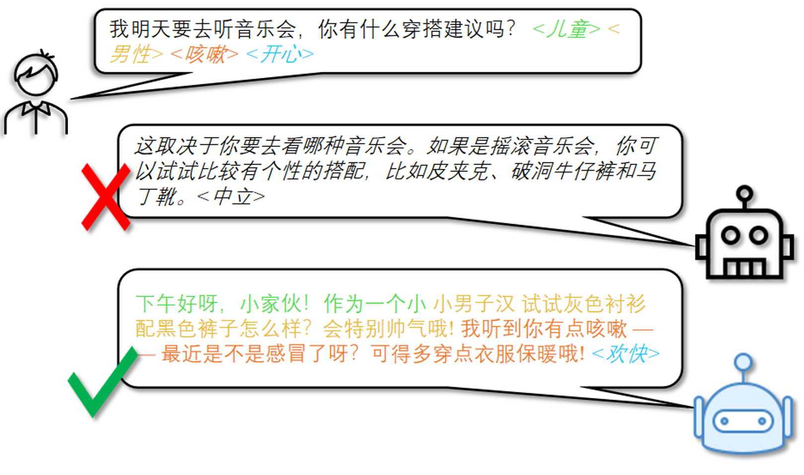
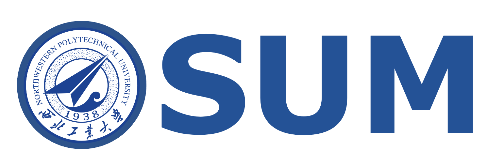
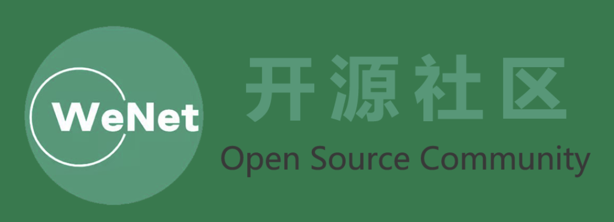

<p align="left">
        中国語&nbsp&nbsp ｜ <a href="README.md">English</a> &nbsp ｜ <a href="README_JP.md">日本語</a> &nbsp
<p>


<p align="center">
   <h1>OSUM-EChat: Enhancing End-to-End Empathetic Spoken Chatbot via Understanding-Driven Spoken Dialogue</h1>
<p>

耿雪龙、邵琪杰、薛鸿飞、王水源、解晗轲、郭昭、赵懿、李国健、田文杰、王成友、赵致闲、夏康翔、张子萸、林振楠、左天伦、邵明辰、曹雨昂、马国斌、李龙豪、戴宇航、高德辉、郭大可、谢磊

<p align="center">
    
<p>

<p align="center">
 <a href="https://www.osum-echat.npu-aslp.org/"> Test Page</a> </a>&nbsp
<br>
📑 <a href="https://www.arxiv.org/abs/2508.09600">Paper</a> &nbsp&nbsp | &nbsp&nbsp 📑 <a href="https://aslp-lab.github.io/osum-echat.github.io/">Demo</a> &nbsp&nbsp | &nbsp&nbsp 💬 <a href="raw/fig/wechat.png">WeChat (微信)</a>&nbsp&nbsp 
</p>

共感能力は、音声対話システムにおける自然なインタラクションを実現するために極めて重要であり、機械が年齢・性別・感情などのパラ言語的手がかりを正確に捉え、共感的な応答を返すことを求められます。  
近年、エンドツーエンドの音声言語モデル（音声理解と生成を統合可能）の発展は、この分野に非常に有望な解決策を提供しています。  
しかしながら、現行技術には依然として多くの課題があります：大規模対話データセットへの過度な依存、共感伝達に不可欠なパラ言語手がかりの抽出不足、そして共感に特化したデータセットと評価フレームワークの欠如です。  
これらの課題を解決するために、我々は **OSUM-EChat** を提案します —— オープンソースのエンドツーエンド音声対話システムであり、特にリソース制約下で共感的インタラクション能力を強化することを目的としています。  
[OSUM](https://github.com/ASLP-lab/OSUM/tree/main/OSUM) を基盤とし、OSUM-EChat は2つの主要な革新を含みます：（1）三段階の理解駆動型音声対話訓練戦略。これは大規模音声理解モデルの能力を音声対話タスクへ拡張します；（2）言語とパラ言語の二重思考メカニズム。思考チェーンを通じてパラ言語理解と対話生成を統合し、より共感的な応答を生成可能にします。この方法により、大規模対話データセットへの依存を減らしつつ、高品質な共感的インタラクションを維持できます。さらに、我々は **EChat-200K データセット**（豊富な共感音声対音声対話コーパス）と **EChat-eval ベンチマーク**（対話システムの共感能力を評価する包括的フレームワーク）を構築しました。実験結果は、共感応答能力において OSUM-EChat が既存のエンドツーエンド音声対話モデルを上回ることを示し、その有効性を検証しました。


<p align="center">
    
<p>

## Architecture

本節では OSUM-EChat の全体アーキテクチャと主要タスクの概要を示します。OSUM-EChat は3つのモジュールから構成されています：音声エンコーダ（アダプタ付き）、テキスト LLM、トークンから音声への変換モジュール。さらに、音声理解（音声からテキスト）、音声合成、音声対話、テキスト対話など幅広い音声機能を備えています。また、内部構築した共感対話データとパラ言語情報推論メカニズムにより、音声対話タスクにおいてより共感的な応答を生成できます。

<p align="center">
    
<p>


## 訓練と推論ガイド、および OSUM-EChat の詳細
<p align="left">
OSUM-EChat のさらなる紹介や、推論および訓練の手順については、<a href="OSUM-EChat/README.md">**こちら**</a>をご参照ください。
</p>

## News and Updates

### 2025年10月29日 🔥 リアルタイム対話デプロイコードが公開されました！関連するコードコミットは [こちら](https://github.com/ASLP-lab/Hum-Dial/tree/main/Full-Duplex_Interaction/baseline) で確認できます。

### 2025.10.09 🔥 モデル訓練コードは現在利用可能となりました！関連するコードコミットは[こちら](https://github.com/ASLP-lab/OSUM/commit/60beb2631d1ce0f0ef18ce791e45cd29793bf9e7)から確認できます。

### 2025.8.27 🔥OSUM-EChat をオープンソース化しました！OSUM-EChat のオフライン推論コード、モデルパラメータ、デモページ、体験ページを公開しました。詳細は<a href="OSUM-EChat/README.md">**こちら**</a>をご覧ください。  
モデル訓練コード、リアルタイム対話デプロイコード、EChat-200K データおよび評価データは近日中に公開予定です。

### 2025.8.14 🎉新しいエンドツーエンド共感音声対話モデル —— OSUM-EChat を発表しました。関連論文はすでに公開されています（[OSUM-EChat 論文](http://arxiv.org/abs/2508.09600)）。コードとモデル checkpoint は近日中に公開予定です。  
本モデルは OSUM 音声理解大モデルを基盤とし、「理解 - 生成 - 共感」の三段階訓練プロセスを通じて、革新的に共感関連の推論メカニズムを導入しました。限られた音声対話データ条件下でも業界最先端の共感対話能力を実現しました。我々の知る限り、これは音声理解大モデルに基づいて構築された初の共感対話モデルであり、共感推論分野における先駆的な研究成果です。  

我々は共感推論分野において2種類のアプローチを探索しました：ラベルに基づく推論と自然言語に基づく推論です。どちらの推論メカニズムも性能向上をもたらしましたが、自然言語に基づく推論はより流暢な応答を実現し、微細なパラ言語的手がかりの捕捉を促進することが分かりました。現行バージョンの論文では三段階訓練プロセスとラベルベースの推論を詳述しており、今後のアップデートで自然言語ベースの推論内容を追加予定です。


<br>
<br>
<br>
<br>

<p align="center">
   <h1>OSUM: Advancing Open Speech Understanding Models with Limited Resources in Academia</h1>
<p>

耿雪龙, 魏坤, 邵琪杰, 刘水云*, 林振楠*, 赵致闲*, 李国健*, 田文杰*, 陈培坤, 李泱泽, 郭鹏程, 邵明辰, 王水源, 曹雨昂, 王成有, 徐天翼, 戴宇航, 朱新发, 李越, 张丽, 谢磊†


<p align="center">
    
<p>

<p align="center">
 <a href="https://huggingface.co/spaces/ASLP-lab/OSUM"> Huggingface Test Page</a> </a>&nbsp
<br>
📑 <a href="https://arxiv.org/abs/2501.13306v2">Paper (v2.0)</a> &nbsp&nbsp | &nbsp&nbsp 📑 <a href="https://aslp-lab.github.io/OSUM.github.io/">Demo</a> &nbsp&nbsp | &nbsp&nbsp 💬 <a href="images/introduction.md">WeChat (微信)</a>&nbsp&nbsp 
</p>

<h3 align="center">OSUMは ‘awesome’ (/ˈɔː.səm/) と読む</h3>

大規模言語モデル（LLMs）は様々な下流タスクで顕著な進展を遂げ、音声理解言語モデル（speech understanding language models, SULMs）の開発を業界に促し、音声感情・性別など副言語に基づく高表現力の対話を実現することを目指しています。しかし、最先端のSULMsの多くは業界大手企業によって開発され、大規模なデータと計算資源を消費しており、これは学術界では容易に得られるものではありません。さらに、学習済みモデルと推論コードはオープンソース化されていますが、学習フレームワークやデータ処理プロセスは依然として透明性に欠けており、さらなる研究の障害となっています。本研究では、OSUMというオープンな音声理解モデルを提案し、限られた学術資源でSULMsを学習する可能性を探ります。OSUMモデルはWhisperエンコーダとQwen2 LLMを組み合わせ、音声認識（ASR）、タイムスタンプ付き音声認識（SRWT）、音声イベント検出（VED）、音声感情認識（SER）、話し方スタイル認識（SSR）、話者性別分類（SGC）、話者年齢予測（SAP）、音声テキストチャット（STTC）など幅広い音声タスクをサポートします。ASR+Xトレーニング戦略を採用することで、OSUMはモダリティ整合性と目標タスクを同時に最適化し、高効率で安定したマルチタスク学習を実現しました。強力な性能を提供するだけでなく、OSUMは透明性を強調し、公開利用可能なコードを提供し、データ処理プロセスを詳細に紹介することで、学術界にとって有益な参考資料を目指しています。これにより、先進的なSULM技術の研究とイノベーションを加速させることを目的としています。

## Architecture

OSUMモデルはWhisperエンコーダとQwen2 LLMを組み合わせ、音声認識（ASR）、タイムスタンプ付き音声認識（SRWT）、音声イベント検出（VED）、音声感情認識（SER）、話し方スタイル認識（SSR）、話者性別分類（SGC）、話者年齢予測（SAP）、音声テキストチャット（STTC）など幅広い音声タスクをサポートします。ASR+Xトレーニング戦略を採用することで、OSUMはモダリティ整合性と目標タスクを同時に最適化し、高効率で安定したマルチタスク学習を実現しました。

<p align="center">
    
<p>

## 学習と推論ガイドおよびOSUMの詳細
<p align="left">
OSUMのさらなる紹介情報、ならびにOSUMフレームワークを用いた推論と学習の操作方法については、<a href="OSUM/README.md">**こちら**</a>をご参照ください。
</p>


## News and Updates

### 2025.2.16 🎉我々は技術レポート [OSUM technical report v2.0](https://arxiv.org/abs/2501.13306v2) を更新し、[checkpoint](https://huggingface.co/ASLP-lab/OSUM) を公開、さらに Hugging Face 上のオンライン [test page](https://huggingface.co/spaces/ASLP-lab/OSUM) をリリースしました。
技術レポート v2.0 では、OSUMモデルがより多くの学習ステップを経て、学習データ量が 50.5K 時間に増加しました（v1.0 の 44.1K 時間と比較して）：
- 3000 時間の音声性別分類（SGC）データ。内訳は1500時間の既存データ（ノイズ拡張済み）と、1500時間の新データ。
- 話者年齢予測（SAP）データ拡張：既存の 3400 時間の年齢予測データにノイズ拡張を行い、データ量を 6800 時間に増加。
### 2025.1.22 🔥 我々は [OSUM technical report v1.0](https://arxiv.org/abs/2501.13306v1) を公開しました。


<br>


# License Agreement

我々は Apache 2.0 ライセンスを使用しています。研究者や開発者は、我々のOSUMのコードやモデル重みを自由に利用でき、商用利用も可能です。詳細についてはライセンスファイル [LICENSE.txt](LICENSE.txt) をご確認ください。
<br>
# Citation
```

@article{geng2025osum,
title={OSUM-EChat: Enhancing End-to-End Empathetic Spoken Chatbot via Understanding-Driven Spoken Dialogue},
author={Geng, Xuelong and Shao, Qijie and Xue, Hongfei and Wang, Shuiyuan and Xie, Hanke and Guo, Zhao and Zhao, Yi and Li, Guojian and Tian, Wenjie and Wang, Chengyou and others},
journal={arXiv preprint arXiv:2508.09600},
year={2025}
}

```
```

@article{geng2025osum,
title={{OSUM}: {Advancing} Open Speech Understanding Models with Limited Resources in Academia},
author={Geng, Xuelong and Wei, Kun and Shao, Qijie and Liu, Shuiyun and Lin, Zhennan and Zhao, Zhixian and Li, Guojian and Tian, Wenjie and Chen, Peikun and Li, Yangze and others},
journal={arXiv preprint arXiv:2501.13306},
year={2025}
}

```
# Contact Us

もし我々の研究チームにメッセージを送りたい場合は、電子メール `xlgeng@mail.nwpu.edu.cn` までご連絡ください。
<p align="center">
    <a href="http://www.nwpu-aslp.org/">
        
    </a>
</p>
<p align="center">
    <a href="https://wenet.org.cn/">
        
    </a>
</p>


